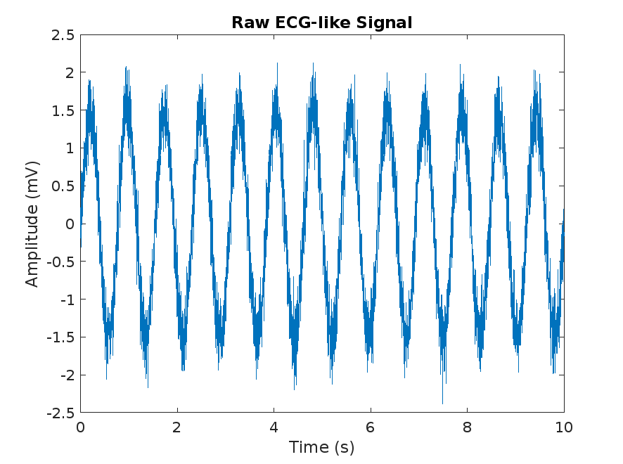
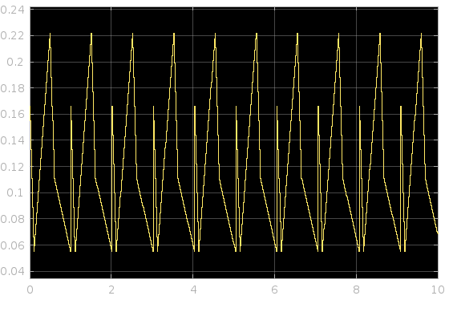

#  محاكاة وفلترة إشارة ECG باستخدام MATLAB وSimulink

مشروع تعليمي مبسّط يوضح كيفية **توليد إشارة ECG صناعية**، ثم **فلترتها باستخدام مرشح Bandpass** (0.5–45 Hz)، وأخيرًا **عرض الإشارة قبل وبعد الفلترة** باستخدام أدوات MATLAB وSimulink.

---

##  الترجمة

🔹 [English version](README.md)  
🔹 🇩🇪 [النسخة الألمانية ](README_de.md)

---

## 📁 ملفات المشروع

| اسم الملف              | الوصف                                              |
|------------------------|-----------------------------------------------------|
| `generate_ecg_signal.m` | سكربت MATLAB لتوليد إشارة ECG مع ضوضاء            |
| `ecg_signal.mat`        | ملف الإشارة المحفوظة لاستخدامها داخل Simulink     |
| `ecg_simulation.slx`    | نموذج Simulink يحتوي فلتر bandpass وبلوك Scope     |
| `raw_ecg.png`           | صورة للإشارة الأصلية غير المفلترة                 |
| `filtered_ecg.png`      | صورة للإشارة بعد الفلترة من الـ Scope             |

---

##  خطوات التشغيل

1. شغّل الملف `generate_ecg_signal.m` داخل MATLAB لتوليد الإشارة.
2. افتح النموذج `ecg_simulation.slx` داخل Simulink.
3. اضغط على زر **Run** لتشغيل المحاكاة.
4. افتح البلوك **Scope** لعرض الإشارة المفلترة.

---

##  أمثلة من الإشارات

### الإشارة الأصلية:

---

### الإشارة بعد الفلترة:

---

##  المنفذة

**وسن قصي حسن**  
مهندسة طبية حيوية  — العراق 🇮🇶

---

##  كلمات مفتاحية

`ECG` `معالجة الإشارات` `Simulink` `MATLAB` `الهندسة الطبية` `فلترة` `Bandpass`

