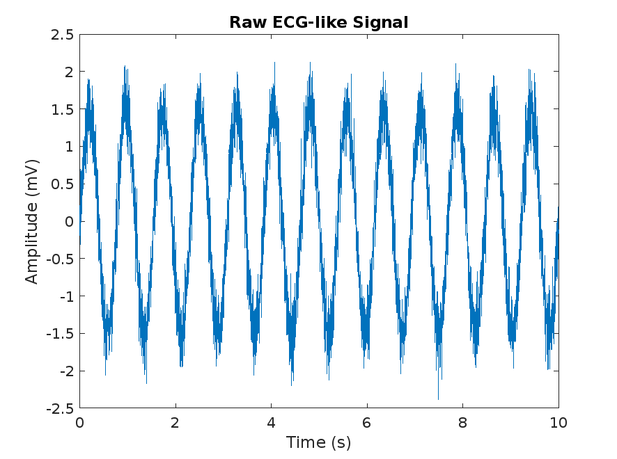

#  Simulation und Filterung eines EKG-Signals mit MATLAB und Simulink

Ein einfaches Lernprojekt zur **Simulation**, **Filterung** und **Visualisierung** eines synthetischen EKG-Signals mit MATLAB und Simulink.  
Dieses Projekt richtet sich an Studierende der Biomedizinischen Technik und verwandter Fachrichtungen.

---

##  Übersetzungen

🔹 [Englisch (English)](README.md)  
🔹 [Arabisch (العربية)](README_ar.md)

---

## 📁 Projektdateien

| Dateiname              | Beschreibung                                                   |
|------------------------|----------------------------------------------------------------|
| `generate_ecg_signal.m` | MATLAB-Skript zur Erzeugung eines verrauschten EKG-Signals    |
| `ecg_signal.mat`        | Gespeicherte EKG-Daten für die Verwendung in Simulink         |
| `ecg_simulation.slx`    | Simulink-Modell mit Bandpass-Filter (0.5–45 Hz) und Scope     |
| `raw_ecg.png`           | Diagramm des ungefilterten EKG-Signals                        |
| `filtered_ecg.png`      | Diagramm des gefilterten EKG-Signals aus dem Scope            |

---

##  Ausführen des Projekts

1. Führe `generate_ecg_signal.m` in MATLAB aus, um das Signal zu erzeugen.
2. Öffne das Modell `ecg_simulation.slx` in Simulink.
3. Klicke auf **Run**, um die Simulation zu starten.
4. Doppelklicke auf den **Scope**, um das gefilterte Signal anzuzeigen.

---

##  Signalbeispiele

### Rohes EKG-Signal:

---

### Gefiltertes EKG-Signal:

---

##  Autorin

**Wasan Qusay Hasan**  
Biomedizinische Ingenieurin — Irak 🇮🇶

---

##  Schlagwörter

`EKG` `Signalverarbeitung` `Simulink` `MATLAB` `Biomedizinische Technik` `Filterung` `Bandpass`

